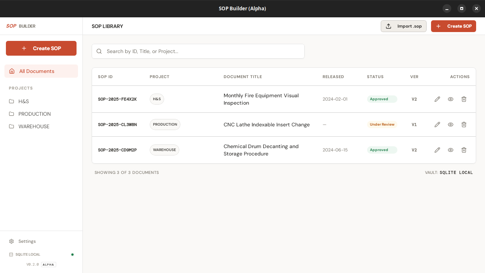
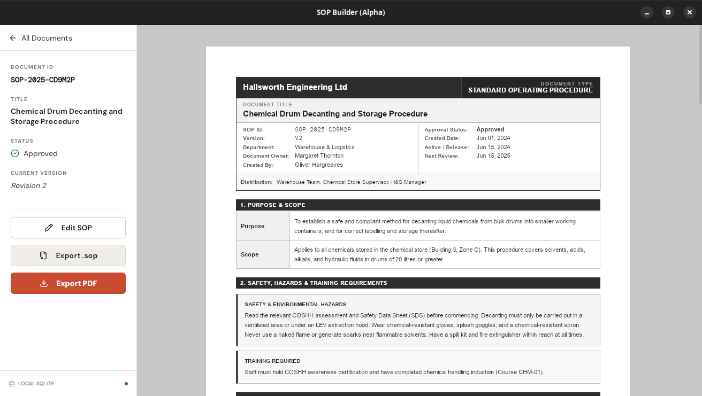
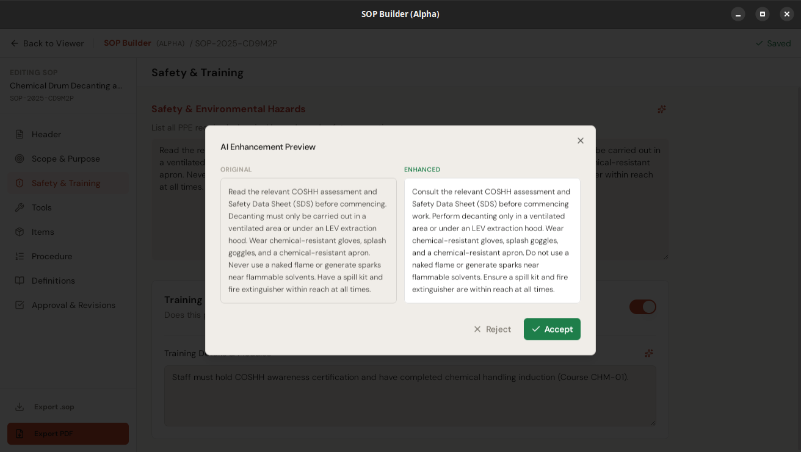
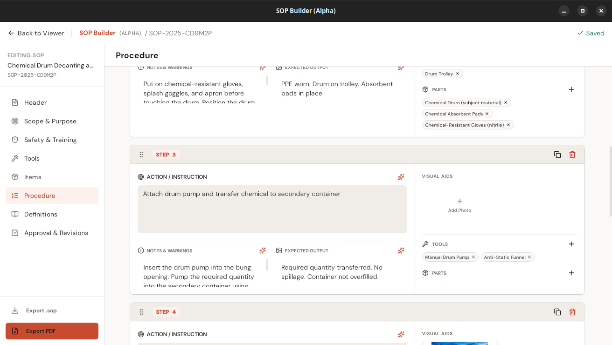
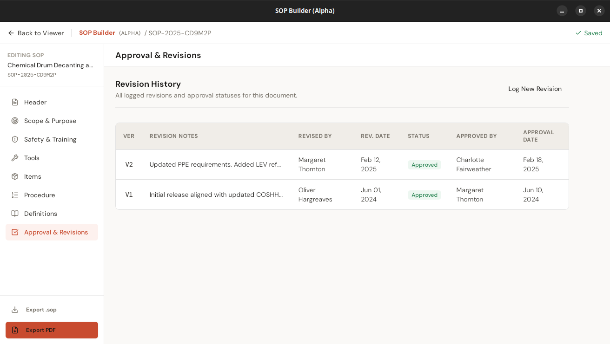

# SOP Builder (Alpha)

> **Alpha status:** This software is in an early release phase. While functional end-to-end, it may contain bugs or breaking changes. Always maintain independent backups of your SOP data.

Current app version: **0.2.1**

SOP Builder is an offline-first desktop application for creating, editing, reviewing, and exporting Standard Operating Procedures (SOPs).

---

## About

SOP Builder bridges the gap between "paper and pencil" and complex enterprise SaaS. Technical and industrial teams often struggle with documentation that is either too messy to follow or locked behind expensive, cloud-only subscriptions.

**Mission:** A professional-grade, local-first tool that gives teams full ownership of their knowledge.

### Why SOP Builder?
- **Data sovereignty:** SOPs are stored in a local SQLite vault. No cloud, no login, no data tracking.
- **Industrial rigor:** Built-in revision history, approval metadata, soft delete, and unique SOP ID tracking.
- **Visual first:** Integrated image crop and annotation tools designed for step-by-step mechanical and technical instructions.
- **Portable:** Export individual SOPs to self-contained `.sop` bundles for offline sharing across high-security facilities.
- **AI-assisted writing:** Optional AI text enhancement on every prose field using your own API key. Supports Anthropic, OpenAI, and Gemini.

---

## Screenshots

**SOP Library** — browse, search, and filter all documents by project tag and approval status.



**Document Viewer** — structured read-only view with full header, purpose, scope, safety notes, and step procedure rendered as a formatted document.



**AI Enhancement** — before/after preview before accepting a rewrite.



**Procedure Editor** — author sequential steps with action text, notes, expected output, visual aids, and attached tools and parts. Sparkle buttons available on every field.



**Revision History** — full audit trail of every revision with status, approver, and date.



---

## Tech Stack

- **Frontend:** React 19, TypeScript, Vite, Tailwind CSS, shadcn/ui
- **State:** Zustand
- **Drag and drop:** dnd-kit for step reordering
- **Image handling:** react-image-crop, react-konva, konva
- **Desktop runtime:** Tauri v2
- **Backend:** Rust, Tokio
- **Database:** SQLite via `sqlx`

---

## Features

- Author SOPs in a structured editor with auto-save
- Revision history and approval metadata
- Full Tools and Items library with search and clone
- Item-level Qty field for SOP-level bill of materials
- Step editor with image annotation, tool/item attachments, inline quantity/unit entry, drag-to-reorder, and add-step scroll preservation
- AI text enhancement on all prose fields — uses your own Anthropic, OpenAI, or Gemini API key; keys stored reliably in SQLite with an encrypted OS keyring copy (Windows Credential Manager, macOS Keychain, Linux Secret Service) where available
- Export SOPs to printable, text-selectable PDF via headless Chromium/Edge print-to-PDF
- Portable `.sop` import/export bundles
- In-app auto-update with launch dialog, Settings check, progress feedback, error details, and manual release fallback

---

## Platforms

| Platform | Status | Notes |
|---|---|---|
| Linux | ✅ Supported | AppImage (recommended) or .deb |
| Windows | ✅ Supported | NSIS .exe (recommended) or .msi |
| macOS | ✅ Supported | Apple Silicon (M1+) only — .dmg. App is unsigned; if you see **"damaged and can't be opened"**, run `xattr -cr /Applications/sop-builder.app` in Terminal, then launch normally. |

---

## Local Development

### Prerequisites

- Node.js 20+ and npm
- Rust stable toolchain via `rustup`
- Tauri v2 system dependencies: [tauri.app/start/prerequisites](https://tauri.app/start/prerequisites/)

**Linux extra packages:**
```bash
sudo apt-get install libwebkit2gtk-4.1-dev libgtk-3-dev librsvg2-dev libayatana-appindicator3-dev patchelf
```

### Setup

```bash
npm install
```

### Run

```bash
npm run tauri dev        # Full desktop app (Tauri + frontend)
npm run dev              # Frontend only (Vite)
```

### Build

```bash
npm run tauri build      # Distributable installer/package
npm run build            # Frontend bundle only
```

---

## Repository Structure

```text
Simple-SOP/
|-- docs/
|   |-- SOP_BUILDER_SPEC.md          # Canonical product and implementation spec
|   |-- index.html                   # Public documentation/marketing page
|   `-- screenshots/                 # Landing page screenshots
|-- public/
|   `-- pdf-template.html            # Runtime PDF export template
|-- src/                             # React frontend (TypeScript)
|   |-- components/
|   |-- pages/
|   |   |-- Home.tsx
|   |   |-- Editor.tsx
|   |   |-- Viewer.tsx
|   |   `-- Settings.tsx
|   |-- store.ts
|   `-- types.ts
|-- src-tauri/                       # Rust backend and Tauri app
|   |-- src/
|   |   |-- commands.rs              # Tauri command handlers
|   |   |-- db.rs                    # DB init, schema, migrations
|   |   `-- lib.rs                   # App bootstrap
|   `-- tauri.conf.json
`-- package.json
```

---

## Architecture Notes

- Auto-save triggers on field changes with 500ms debounce.
- SQLite runs in WAL mode with foreign keys enabled.
- DB integrity check runs at initialization.
- Images are stored on disk by UUID; SQLite holds only references.
- SOP IDs follow `SOP-{YYYY}-{6CHAR}` format with an unambiguous character set.
- `.sop` bundles contain a JSON snapshot plus all referenced image files.
- PDF export injects SOP data into `public/pdf-template.html`, embeds images as base64 data URIs, and renders through a Chromium-family browser in headless print-to-PDF mode.
- AI keys are always written to SQLite as the reliable source of truth, with an additional encrypted copy in the OS keyring (Windows Credential Manager, macOS Keychain, Linux Secret Service) where available. This dual-store approach prevents key loss caused by cross-async-task keyring read failures on Windows and Linux.
- Updates are served via a signed `latest.json` on GitHub Releases, covering Linux x86_64, Windows x86_64, and macOS aarch64.

See `docs/SOP_BUILDER_SPEC.md` for complete behavior rules and constraints.

---

## Development Workflow

- Read `docs/SOP_BUILDER_SPEC.md` before implementing behavior changes.
- Keep the Viewer and `public/pdf-template.html` aligned.
- Use Tauri commands for all persistent writes.
- Validate frontend (`npm run build`) and Rust (`cargo check` in `src-tauri/`) after meaningful changes.
- For releases, bump the version in both `src-tauri/Cargo.toml` and `package.json`, push to `master`, and manually dispatch `.github/workflows/release.yml` with a matching tag such as `v0.2.0`.

---

## Current Known Limitations

- Linux `.deb` installs cannot self-update in place through the Tauri updater. Use the AppImage for auto-update support, or download `.deb` releases manually.
- Windows installers are unsigned. Windows SmartScreen may warn on the first install; in-app updater downloads are still signature-verified by Tauri.
- macOS builds are unsigned and unnotarized. If you see **"damaged and can't be opened"**, open Terminal and run `xattr -cr /Applications/sop-builder.app`, then launch normally. Subsequent launches and auto-updates are unaffected.
- macOS Intel (x86_64) is not supported. Apple Silicon (M1 or later) only.
- PDF export requires a Chromium-family browser (Chrome, Edge, Chromium, or Brave) to be installed on the machine. A warning is shown in the app if none is detected.

---

## License

Licensed by **SOP Builder Software** under the **MIT License + Commons Clause**.

- **Free for use:** Individuals and organizations can use, modify, and self-host for free.
- **No resale:** You cannot sell this software or offer it as a paid SaaS.
- **No liability:** Authors are not responsible for data loss, physical harm, or business interruption.
- **Trademarks:** "SOP Builder" and its logos cannot be used to brand a competing service.

See [LICENSE](LICENSE) for the full legal text.
